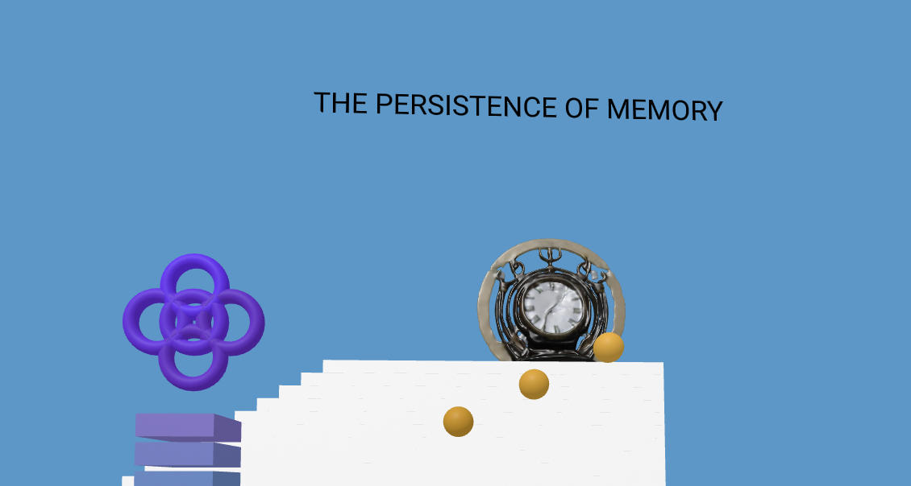

# 3D Shapes in p5.js

This project showcases a 3D virtual environment created with p5.js, featuring various geometric primitives like boxes, spheres, cylinders, and toruses. The environment includes custom structures, such as towers, floating spheres, and ringed torus formations, to create an engaging and visually rich scene.

## Features
- Towers: Stacked boxes to form vertical structures.
- Floating Spheres: Spheres suspended at different heights, adding depth and variety.
- Ringed Torus Structure: A triangular arrangement of toruses for a futuristic aesthetic.
- Central Cylinder: A prominent cylinder serving as the centerpiece.
- Dynamic Environment: Elements positioned to create a cohesive 3D scene.
- 3D Models
  
## Technologies Used

p5.js: A JavaScript library for creative coding.
A-Frame Integration: Used to render the 3D environment.
